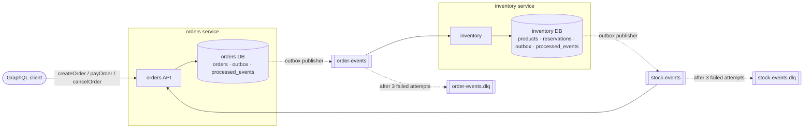

# orderflow

[](https://github.com/lemmy-code/orderflow/actions/workflows/ci.yml)

Two NestJS services that process orders over Kafka: **orders** (GraphQL API) and **inventory** (stock). They never call
each other; every state change and the event announcing it are committed together, then published by an outbox.



## Run it

```bash
docker compose up --build --wait
```

GraphQL at <http://localhost:3000/graphql>. Seeded products:

| Product | id | Price | Stock |
|---|---|---|---|
| Mechanical keyboard | `11111111-1111-4111-8111-111111111111` | 89.99 | 10 |
| Wireless mouse | `22222222-2222-4222-8222-222222222222` | 29.99 | 5 |
| 27-inch monitor | `33333333-3333-4333-8333-333333333333` | 249.99 | 1 |

```graphql
mutation { createOrder(items: [{ productId: "11111111-1111-4111-8111-111111111111", quantity: 2 }]) { id status } }
query    { order(id: "<id>") { status totalCents items { productId quantity unitPriceCents } } }
mutation { payOrder(id: "<id>") { status } }
```

An order starts `PENDING`, becomes `RESERVED` or `REJECTED` (with a reason) once inventory answers, then `PAID` or
`CANCELLED`. Errors carry `extensions.code`: `BAD_USER_INPUT`, `NOT_FOUND` or `INVALID_STATE`.

## Design decisions

- **Transactional outbox.** The order row and its `order.created` event are written in one transaction; a publisher
  loop sends unsent rows to Kafka. A crash can delay an event but never lose one or invent one. Inventory replies
  through its own outbox for the same reason.
- **Idempotent consumers.** Kafka delivers at least once. Each handler records the event id in `processed_events` in
  the same transaction as its change, so a redelivery is a no-op.
- **One topic per stream, keyed by order id.** `order.created` and `order.cancelled` share `order-events`, so Kafka
  keeps them in order for each order.
- **No overselling.** Inventory locks product rows (`SELECT … FOR UPDATE`, in id order to avoid deadlocks) before it
  checks and decrements stock.
- **Dead-letter topics.** A failing message is retried 3 times with backoff, then moved to `<topic>.dlq` with the error,
  so one bad message never blocks a partition. Invalid payloads skip the retries.
- **No config at import time.** Every env var is read when its module starts and has a local default. CI runs from a
  clean checkout with no `.env`.

## Testing strategy

| Layer | Question it answers | Runs against | Command |
|---|---|---|---|
| Unit | Is the logic right? (state machine, stock rules, retry policy, validation, contracts) | nothing | `npm run test:unit` |
| Integration | Do the pieces work with a real database? (atomic outbox, row locks under concurrency, duplicate events) | PostgreSQL (Testcontainers) | `npm run test:int` |
| End to end | Does the system work? Both services, real Kafka: reserve, reject, release, duplicate delivery, poison message → DLQ | PostgreSQL + Kafka (Testcontainers) | `npm run test:e2e` |

CI runs lint, typecheck and all three layers on every push, and a second job boots the Compose stack and places an
order. Locally you need Node 24.9+ and a running Docker engine (Docker Desktop, OrbStack or Colima; with Colima also
`export TESTCONTAINERS_DOCKER_SOCKET_OVERRIDE=/var/run/docker.sock`).

## Stack

TypeScript · NestJS 12 · GraphQL (Apollo, code-first) · PostgreSQL · TypeORM · Kafka (KafkaJS) · Jest · Supertest ·
Testcontainers · Docker Compose · GitHub Actions
