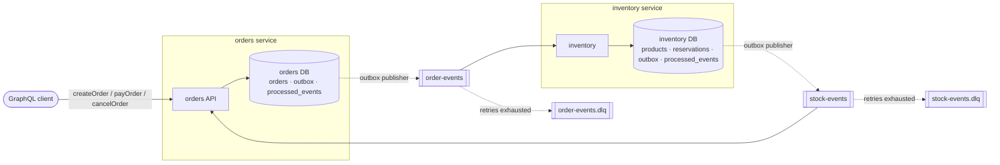

# orderflow

[](https://github.com/lemmy-code/orderflow/actions/workflows/ci.yml)

Two NestJS services that process orders over Kafka: **orders** (GraphQL API) and **inventory** (stock). They never call
each other; every state change and the event announcing it are committed together, then published by an outbox.



## Run it

```bash
docker compose up --build --wait
```

GraphQL at <http://localhost:3000/graphql>. The Compose file is for local development: every port is bound to
`127.0.0.1`, each service connects with its own database login that can only open its own database, and the
passwords in it are throwaway local defaults, not secrets.

Seeded products:

| Product | id | Price | Stock |
|---|---|---|---|
| Mechanical keyboard | `11111111-1111-4111-8111-111111111111` | 89.99 | 10 |
| Wireless mouse | `22222222-2222-4222-8222-222222222222` | 29.99 | 5 |
| 27-inch monitor | `33333333-3333-4333-8333-333333333333` | 249.99 | 1 |

```graphql
mutation { createOrder(items: [{ productId: "11111111-1111-4111-8111-111111111111", quantity: 2 }]) { id status } }
query    { order(id: "<id>") { status totalCents items { productId quantity unitPriceCents } } }
mutation { payOrder(id: "<id>") { status } }
```

An order starts `PENDING`, becomes `RESERVED` or `REJECTED` (with a reason) once inventory answers, then `PAID` or
`CANCELLED`. Resolver errors carry `extensions.code`: `BAD_USER_INPUT`, `NOT_FOUND` or `INVALID_STATE`. A request that is
not valid GraphQL to begin with (for example `quantity: 1.5` written inline) is rejected by GraphQL itself with
`GRAPHQL_VALIDATION_FAILED`.

`./scripts/smoke.sh` places an order against the running stack and waits until inventory has reserved it.

## Design decisions

- **Transactional outbox.** The order row and its `order.created` event are written in one transaction; a publisher
  loop sends unsent rows to Kafka. A crash can delay an event, or make it go out twice (sent, then the "sent" mark
  rolled back), but never lose one or invent one. Inventory replies through its own outbox for the same reason.
- **One publisher at a time.** Each batch takes a Postgres advisory lock, so several instances of a service can run
  without two publishers interleaving one order's events out of order.
- **Idempotent consumers.** Kafka and the outbox both deliver at least once. Each handler records the event id in
  `processed_events` in the same transaction as its change, so a redelivery is a no-op.
- **One topic per stream, keyed by order id.** `order.created` and `order.cancelled` share `order-events`, so Kafka
  keeps them in order for each order.
- **No overselling.** Inventory locks product rows (`SELECT … FOR UPDATE`, in id order to avoid deadlocks) before it
  checks and decrements stock.
- **Retries, then dead letters, then redrive.** A failing handler is retried with doubling backoff capped at 30 s, 10
  attempts over about 80 s, so a database restart doesn't drop valid events. After that the message moves to
  `<topic>.dlq` with the error, so it can't block its partition forever. Invalid payloads go there immediately.
  `npm run redrive -- order-events` replays the valid ones (safe, because consumers ignore event ids they've seen) and
  leaves contract violations where they are.
- **No config at import time.** Every env var is read when its module starts and has a local default. CI runs from a
  clean checkout with no `.env`.

## Testing strategy

| Layer | Question it answers | Runs against | Command |
|---|---|---|---|
| Unit | Is the logic right? (state machine, stock rules, retry policy, validation, contracts) | nothing | `npm run test:unit` |
| Integration | Do the pieces work with a real database? (atomic outbox, row locks under concurrency, duplicate events) | PostgreSQL (Testcontainers) | `npm run test:int` |
| End to end | Does the system work? Both services, real Kafka: reserve, reject, release, duplicate delivery, poison message → DLQ, redrive | PostgreSQL + Kafka (Testcontainers) | `npm run test:e2e` |

CI runs lint, typecheck and all three layers on every push, and a second job boots the Compose stack and runs
`scripts/smoke.sh`. Locally you need Node 24.9+ and a running Docker engine (Docker Desktop, OrbStack or Colima; with Colima also
`export TESTCONTAINERS_DOCKER_SOCKET_OVERRIDE=/var/run/docker.sock`).

## Project docs

- [Design spec](docs/superpowers/specs/2026-10-07-orderflow-design.md): requirements, architecture, failure handling, and
  the revisions made during planning and review (§10).
- [Implementation plan](docs/superpowers/plans/2026-10-07-orderflow.md): the task-by-task, test-first plan it was built
  from.

## Stack

TypeScript · NestJS 12 · GraphQL (Apollo, code-first) · PostgreSQL · TypeORM · Kafka (KafkaJS) · Jest · Supertest ·
Testcontainers · Docker Compose · GitHub Actions
